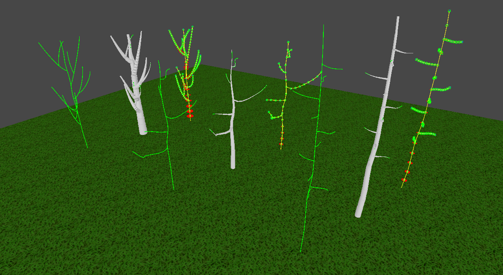

# Распространение лесных пожаров на мезомасштабном уровне с учётом физики растительности в режиме реального времени
Данная работа представляет собой моделирование распространения лесных пожаров в трёхмерном пространстве. Основной особенностью является возможность моделирования физики растительности в реальном времени для множества детализированных деревьев в масштабе леса. Достигнуто это было благодаря модификации мезомасштабного представления растительности за счёт введения физического представления модулей и связей между ними. 

Проект является частью магистерской выпускной квалификационной работы образовательной программы "Технологии разработки компьютерных игр" [школы разработки видеоигр Университета ИТМО](https://itmo.games/). Для реализации разработанной модели был выбран инструментарий игрового движка Unity.

## Обзор
На изображении ниже представлены три основных этапа генерации экземпляров моделей растительности на основе модификации мезомасштабного подхода: формирование графового представления структуры дерева, апроксимация исходной геометрии дерева, генерация модулей и их физических оболочек.

На изображении ниже представлен один из возможных сценариев распространения лесного пожара. В качестве инициатора пожара выступает факел. Точкой старта пожара является правый нижний угол сцены. Скорость и направление ветра принимаются 5 метров в секунду и южное соответственно. Сцена имеет размеры 40 x 16 x 40 метров. Разрешение сетки 80 x 32 x 80 метров. В сцене присутствует 80 деревьев, каждое из которых состоит из 44 модулей. Каждый модуль находится под постоянным воздействием силы ветра и смещается по его направлению.

## Запуск и использование
Работа является проектом, разработанным в Unity. Для запуска необходимо скачать репозиторий и открыть его через Unity Hub. Собранные тестовые сцены находятся по пути **_Assets/Scenes/TreeScene.unity_** и **_Assets/Scenes/ForestScene.unity_** и содержат настройки из обзора.

### Генерация экземпляров модели растительности
Для того, чтобы приступить к создаю экземпляра модели дерева необходимо создать пустой игровой объект (GameObject) и прикрепить к нему компонент (Component) **Path Creator**. Данный компонент предназначен для формирования графа дерева с помощью кривых Безье.

У данного компонента есть следующие настройки:
-  Control Mode - как точки на кривой Безье будут переходить друг в друга
-  Enable Transforms - включить/выключить отображение Gizmo
-  Reset Path - сбросить траекторию кривой Безье к заводскому положению

Для управления кривой Безье нужно знать:
-  Shift + LMB - добавить точку в конец или внутрь кривой Безье
-  Alt + LMB - удалить точки с кривой Безье

Для того, чтобы начать создавать модули по траектории пути Безье нужно к объекту с компонентом **Path Creator** добавить компонент **Module Prototypes Generator**. Данный компонент предназначен для формирования геометрии дерева на основе многомодульного подхода.

У данного компонента есть следующие настройки:
-  Enable Preview Mode - включить/выключить режим предварительного просмотра геометрии
-  Auto Calculate Radii - включить/выключить автоматический просчет радиусов модулей на прямой Безье
-  Start Spawn Radius - величина радиуса модулей в начале кривой Безье
-  Final Spawn Radius - величина радиуса модулей в конце кривой Безье
-  Recalculate Prototypes Radii - обновить величину радиусов под заданные началой и конец радиусов
-  Add Module Prototype - добавить прототип модуля на кривуюБезье
-  Clear Module Prototypes - удалить все существующих прототипы модулей на кривой Безье

Для того, чтобы изменить положении конктретного модуля на кривой Безье нужно обратиться к компоненту **Module Prototype Data**, который прикрепляется к только созданному на кривой Безье прототипу модуля. Данный компонент предназначен для позиционирования модуля на кривой Безье, а также для настройки толщины ветве в заданной позиции, которую ароксимирует модуль.

У данного компонента есть следующие настройки:
-  Step - шаг интерполяции на кривой Безье
-  Radius - радиус модуля в заданной точке кривой Безье

Для того, чтобы окончательно сгенерировать  модифицированное многомодульное представление дерева нужно в корень полученного представления вложить компонент **Modules Generator**. Данный компонент предназначен для добавления всех необходимых физических компонентов и удаления лишних.

У данного компонента есть следующие настройки:
-  Wood Density - плотность генерируемой породы дерева
-  Preset - сохраненный шаблон настроек для системы частиц

### Моделирование распространения лесных пожаров
Для того, чтобы сгенерировать лесной массив нужно обратиться к компоненту **Forest Filler**.

У данного компонента есть следующие настройки:
-  Tree Prefab - экземпляр дерева, который заполнить лесной массив
-  Distance Between Tress - дистанция отступа экземпляров деревьев друг от друга
-  Positive Position - положительная диагональная позиция заполнения
-  Negative Position - отрицательная диагональная позиция заполнения

 

Для того, чтобы отобразить модули экземпляров деревьев нужно братиться к компоненту **Module Renderer**.

У данного компонента есть следующие настройки:
-  Render Material - материал для отображения модулей через Instanced Rendering
-  Render Mesh - примитив для отображения модулей (предполагается цилиндр)

Для того, чтобы управлять процессом распространения пожара нужно обратиться к компоненту **Widlfire**.

У данного компонента есть следующие настройки:
-  Compute Shader - вычислительный шейдер, в котором 
